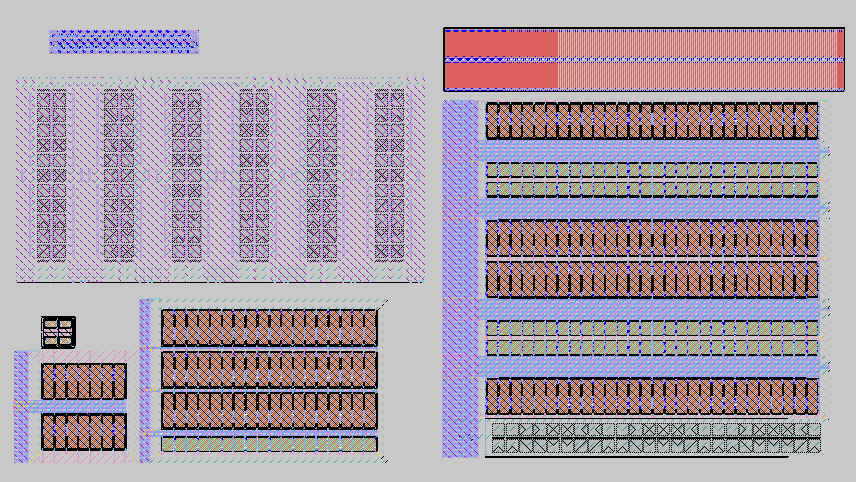

# AFEBioPICO

An <b>Ultra-Low-Power Analog Front-End for Bio-Signals</b> intended to be integrated for the SSCS Platform for IC Design Outreach (PICO) Open-Source Design Contest.  

Table of contents
==============================
<!--ts-->
  * [Summary](#Summary)
    * [Motivation](#Motivation)
  * [Description](#Description)
    * [Block Diagram](#Block-Diagram)
    * [Schematics and Layouts](#Schematics-and-Layouts)
    * [Simulation Results](#Simulation-Results)
    * [Target Performance Summary](#Target-Performance-Summary)
  * [Team Members](#Team-Members)  
  * [References](#References)
<!--te-->

Summary
=======

This design contains an analog signal processing block that:
-  filters DC inputs;
-  amplifies the AC components with an user selected voltage gain; and
-  filters frequencies outside the bio-signals bandwidth.  

In order to bias the circuit a current reference is also provided. All this process is done while consuming only 5 &mu;W for a 1.8 V supply voltage.

### Motivation

As a consequence of the population aging, chronic diseases are becoming the significant cause of death in most countries. Unfortunately, intermittent and asymptomatic features of many chronic disorders turn the task of diagnosis into a real challenge. Due to the new trends of wearable devices for biosensing, predicting and detecting the exact moment that a chronic disease is happening became a possible solution. Hence, it can do a better and timely diagnostic. Therefore, in this project, we propose an ultra-low-power analog front-end to integrate a system for long-term monitoring. We can apply this work to several bio-signals, such as ECG, EMG, and EEG.

Description
===========

The analog front-end for bio-signals main goal is to amplify its inputs, and filter interference and noise without losing resolution, so that the processed signals information can be properly extracted.

### Block Diagram

Our design is composed of four blocks. The `Low-Power Low-Noise Amplifier (LNA)` [1] simultaneously filters the input DC signal and amplifies it. Normally, electrodes output an unknown DC offset which must be canceled, otherwise it would be amplified together with the input signal and saturate the output, causing distortion.

After the first gain stage, a variable gain stage is needed, since the biomedical signals have a varying amplitude due to electrode position and the user own characteristics. This variable gain stage is implemented with a `Variable Gain Amplifier (VGA)` based on cascaded inverting operational amplifiers. These operational amplifiers should have large output voltage excursions, and be capable of driving a relatively large resisitive load as efficiently as possible, so it should have a  class AB output stage [2].

Finally, the VGA output signal must be filtered to limit the noise and interference from unwanted frequencies. Since the biomedical signals usually have a very low upper cutoff frequency, the filters should be made of very low transconductance amplifiers [3] to implement very large time constants with reasonable sized integrated capacitors. Additionally, the `Filter` output must be as linear as possible to minimize distortion, so its transconductors must have improved linearity [4].

All these analog circuit blocks have in common the need of a biasing current. We chose a resistorless `Self-Biased Current Reference Source (SBCS)` [5], since integrated resistors exhibit a larger process variability than MOS transistors.

### Layouts

#### AFE - 700 x 350 um
* All layouts use common-centroid technique
* All wires are shielded, as they are very long and parasitic capacitance between then would be significant. Provides extra protection for noise. Very large parasitic capacitors between signals and the ground plane.
* All designs were made with transistor arrays [3] of 1:8, 4:2 and 8:1 matrices. Each single PMOS single transistor is 3 X 8 um, and each single NMOS is 1 x 8 um.

#### Low-Noise Amplifier (LNA)
* LNA based on [1] with tunable-pseudo resistors [6].
* The LNA OTA is a simple single-stage amplifier with differential pair.and current mirror active load.
---

#### Buffer

---
### Simulation Results

### Target Performance Summary

| Specifications  | -                            |
| :---            | :---                         |
| VDD             | 1.8 V                        |
| Power           | 5 &mu;W                      |
| Input Noise     | 10 &mu;V RMS (@ 0.05-100 Hz) |
| Offset Voltage  | 1 mV                         |
| Gain            | 10-1000 V/V                  |
| Bandwidth       |	0.5-100 Hz                   |
| THD             |	0.1 % @ 1 Vpp     |

Status and Issues
============

* Documentation is extremely incomplete.

Team members
============

**B.Eng. Deni Germano Alves Neto (Deni)**
| [denialves77@gmail.com](mailto:denialves77@gmail.com?subject=Hi% "Hi!")  | 
[Linkedin](https://www.linkedin.com/in/deni-alves-neto)  |

**M.Sc. João Vitor Testi Ferreira (Testi)**
| [testiferreira.jv@gmail.com](mailto:testiferreira.jv@gmail.com?subject=Hi% "Hi!")  | 
[Linkedin](https://www.linkedin.com/in/joão-vitor-testi-ferreira-925305101)  |

**M.Sc. Luís Henrique Rodovalho (Rodovalho)**
| [luishenriquerodovalho@gmail.com](mailto:luishenriquerodovalho@gmail.com?subject=Hi% "Hi!")  | 
[Linkedin](https://www.linkedin.com/in/luís-henrique-rodovalho-moreira-de-lima-765a8a7a)  |

**M.Sc. Rafael Sanchotene Silva (Rafael)**
| [r.sanchotene@gmail.com](mailto:r.sanchotene@gmail.com?subject=Hi% "Hi!")  | 
[Linkedin](https://www.linkedin.com/in/rafael-sanchotene-silva-1a6275b4)  |

**M.Sc. Thiago Daros Fernandes (Thiago)**
| [daros.thiago@gmail.com](mailto:daros.thiago@gmail.com?subject=Hi% "Hi!")  | 
[Linkedin](https://www.linkedin.com/in/thiago-daros-fernandes-20a365115)  |

References
==========

[1] Harrison, Reid R., et al. "A low-power integrated circuit for a wireless 100-electrode neural recording system." IEEE Journal of Solid-State Circuits 42.1 (2006): 123-133.

[2] Hogervorst, Ron, et al. "A compact power-efficient 3 V CMOS rail-to-rail input/output operational amplifier for VLSI cell libraries." IEEE journal of solid-state circuits 29.12 (1994): 1505-1513.

[3] Arnaud, Alfredo, Rafaella Fiorelli, and Carlos Galup-Montoro. "Nanowatt, sub-nS OTAs, with sub-10-mV input offset, using series-parallel current mirrors." IEEE Journal of Solid-State Circuits 41.9 (2006): 2009-2018.

[4] Krummenacher, Francois, and Norbert Joehl. "A 4-MHz CMOS continuous-time filter with on-chip automatic tuning." IEEE Journal of Solid-State Circuits 23.3 (1988): 750-758.

[5] Serra-Graells, Francisco, and Jose Luis Huertas. "Sub-1-V CMOS proportional-to-absolute temperature references." IEEE Journal of Solid-State Circuits 38.1 (2003): 84-88.

[6] Guglielmi, Emanuele, et al. "High-value tunable pseudo-resistors design." IEEE Journal of Solid-State Circuits 55.8 (2020): 2094-2105.

