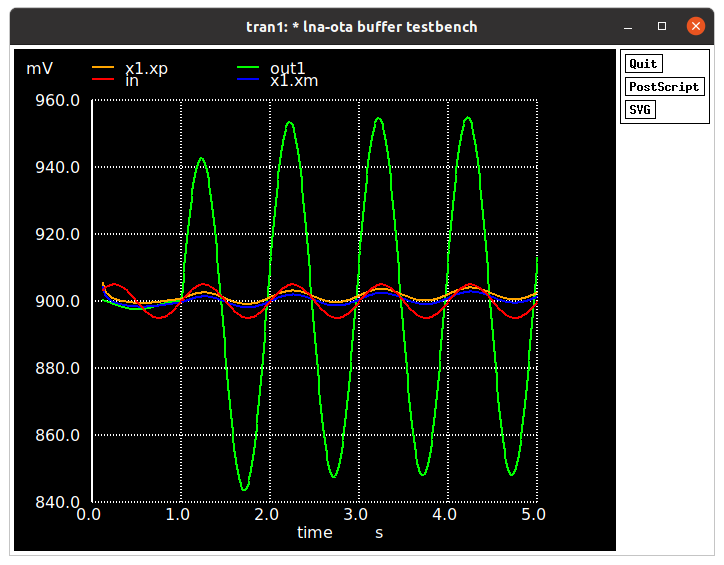

# Low-Noise Amplier - LNA

The LNA is designed with a voltage subtractor topology using capacitive impedances with a `nominal gain of 20dB`. Due to the low frequency corner specification, the output DC coupling is accomplished using `high resistance pseudo-resistors`. A symmectrical OTA is used as the transconductor element. The OTA transistors are big in order to reduce the flicker noise (1/f).

 

Low-Power Low-Noise Amplifier (LNA) [1]

## Layouts
---

LNA layout

---

Matched Pseudo-Resistor layout

---

OTA layout

## Simulation results

### Pseudo-Resistor

Pseudo-resistor biased with 0.1, 1 and 10 nA
* Highly non-linear
* Biasing is necessary to calibrate pseudoresistor after process variability is considered.

### OTA

OTA in-out DC characteristic curve.
* It is a simple differential pair and has limited output voltage excursion, but it already limited by the pseudo-resistor excursion range

### LNA

* The LNA achieves a adequate voltage gain and cutoff frequencies, but simulation with MiM capacitors models is unstable.
* The MiM LNA version OTA inputs are not converging to the virtual ground at 0.9 V (Vdd/2), so the voltage drop at the pseudoresistor is outside its proper range

Idead and MiM capacitor AC simulation results

Ideal capacitor transisent simulation

MiM capacitor transisent simulation

